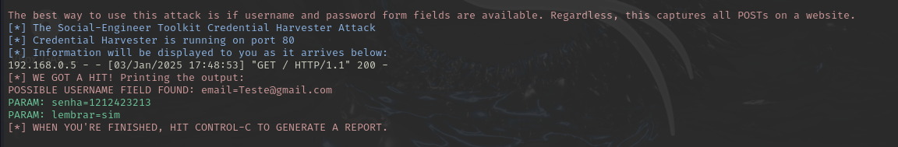

# Phishing para captura de senhas do FACEBOOK

## Prova de Conceito: Análise de Vetores de Phishing via SEToolkit

Este repositório contém a documentação técnica para a execução de uma prova de conceito (PoC) de ataque de engenharia social, utilizando o **Social-Engineering Toolkit (SET)** realizado para fins educacionais. O objetivo é demonstrar a vulnerabilidade de usuários finais à captura de credenciais por meio de clonagem de interface (Site Cloning).

> [!CAUTION]
> **Aviso de Ética e Legalidade:** O uso desta técnica em ambientes sem autorização expressa é ilegal e viola princípios éticos de cibersegurança. Este material possui finalidade estritamente acadêmica e profissional para testes de penetração autorizados.

---

## 1. Contexto Técnico

O ataque baseia-se no método **Credential Harvester**, onde um servidor local intercepta requisições HTTP POST contendo credenciais sensíveis. Este ambiente simula um cenário real de *Phishing*, visando educar profissionais de segurança sobre a importância de perímetros de defesa e conscientização.

### Ferramentas Utilizadas

* **Sistema Operacional:** Kali Linux (Rolling Edition)
* **Framework:** Social-Engineering Toolkit (SET) v8.0+
* **Protocolos:** HTTP/TCP

---

## 2. Procedimento Operacional (Atualizado)

Para a execução desta Prova de Conceito, siga os comandos e seleções de menu abaixo. Certifique-se de que as portas 80 e 443 não estejam sendo ocupadas por outros serviços (como Apache ou Nginx) antes de iniciar.

### 2.1. Elevação de Privilégios e Execução

O framework exige acesso ao socket de rede para escuta em portas baixas:

```bash
sudo setoolkit

```

### 2.2. Sequência de Comandos no Menu Interativo

Uma vez dentro do Social-Engineering Toolkit, utilize a seguinte árvore de comandos:

| Passo | Opção de Menu | Descrição |
| --- | --- | --- |
| **01** | `1` | **Social-Engineering Attacks**: Acessa o módulo de engenharia social. |
| **02** | `2` | **Website Attack Vectors**: Seleciona vetores baseados em web. |
| **03** | `3` | **Credential Harvester Attack Method**: Ativa o coletor de credenciais. |
| **04** | `2` | **Site Cloner**: Define que o método será a clonagem de um site real. |

### 2.3. Configuração do Listener e Target

Após selecionar o método, o sistema solicitará os parâmetros de rede:

1. **IP address for the POST back in Harvester/Tabnabbing:**
* Insira seu IP local (obtido via `ip addr` ou `ifconfig`).
* *Exemplo:* `192.168.1.10`


2. **Enter the URL to clone:**
* Insira a URL oficial do alvo.
* *Entrada:* `https://www.facebook.com`


---

## 3. Fluxo de Captura de Dados

Após a configuração, o SET iniciará um servidor web local. O fluxo de dados seguirá a lógica abaixo:

1. O atacante envia o link (seu IP) para a vítima.
2. A vítima insere os dados no formulário clonado.
3. O SET intercepta o pacote `HTTP POST`.
4. Os dados são exibidos no terminal e salvos em:
` /var/setoolkit/reports/ad_hoc_report.html` (ou diretório similar conforme versão).




---

## 4. Referências

* OFFENSIVE SECURITY. **Kali Linux Documentation**. Disponível em: [https://www.kali.org/docs/](https://www.kali.org/docs/).
* TRUSTEDSEC. **The Social-Engineering Toolkit (SET) Repository**. Disponível em: [https://github.com/trustedsec/social-engineer-toolkit](https://github.com/trustedsec/social-engineer-toolkit).
